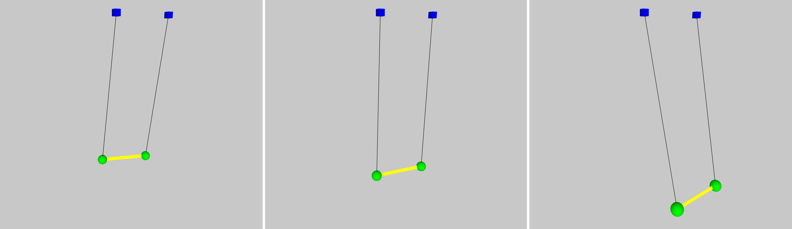
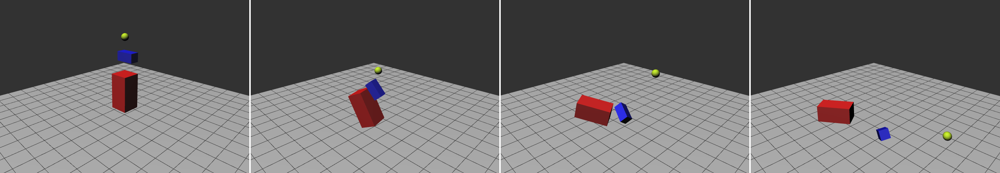

# A Brief Guide to Gaia

## Core Concepts

This section provides a brief introduction to the overall structure and core concepts of the engine.

### Overall Structure

Gaia itself is made up of two separate engines. One engine for simulating particle interactions and another engine for simulating interactions between simple rigid bodies. While these two engines have very different capabilities, their overall structure is very similar for the most part. The core components of this structure are explained in the following sections.

### Worlds

The world classes of both engines is what ties all their individual components together. They allow the utilization of the engines' features without having any explicit knowledge about any of the subsystems involved in performing the actual simulation (i.e. the integrator, collision detector and collision resolver).

### Entities

An entity represents an object simulated by Gaia. Position, velocity, mass and various other properties of an object are stored here.

Within both entity classes of Gaia (`Particle` and `RigidBody`), the mass is stored as inverse mass, as many routines require this value instead of the actual mass. Furthermore, storing the mass as inverse prevents the occurrence of zero mass entities - which has the potential to cause division by zero errors. Another advantage of inverse mass is the fact that it is possible to store infinite mass this way; an entity with infinite mass would effectively be an immovable object, which could represent static structures like walls or floors.

### Force Generators

Forces can change an entity's linear or angular velocity. They have both a magnitude and a direction, meaning they can be described using vectors. For this reason, both entity types have methods allowing for the addition of a force vector. Forces can be classified in certain types; some are exerted by the environment the entities inhabit, like gravity, wind or atmospheric drag. Other forces result from connections between individual objects, caused by constraints like cables or springs.

Both engines use a similar structure to implement forces, which are called *force generators*. A force generator can be used to implement any type of force. As all force generators implement a common interface, the application of a force is always performed through the `updateForce(entity, duration)`. The `entity` is the entity affected by the force and the `duration` is the duration of the time frame for which the force affects the entity, which usually is the duration of the most recent integration step of the engine.

Each engine features various force generator implementations, though the rigid body engine has far fewer than the particle engine. The primary and most basic force both engines have in common is gravity.

### Contact Generators

For the most part, the engine utilizes collisions to keep objects apart or to prevent them from sinking into each other; once two objects move too close to each other, the engine generates a contact and its resolution results in the bodies either moving apart or remaining in place. Collisions can also be used to prevent objects from straying too far away from one another. This functionality is implemented in a similar way to force generators; structures capable of generating collisions in order to prevent the violation of a constraint are thus referred to as *contact generators*. They are capable of simulating connections that are not spring-like, for example cables or rods.

## Configuration

The Gaia engine features a global settings instance, accessible through `Configuration.getConfig()`. The there stored values are utilized by both the particle and the rigid body engine.

The most important setting is the so-called *Processing factor*. While Gaia utilizes a coordinate system with the same orientation as Processing's own coordinate system, it doesn't quantify values on the axis based on pixels the way Processing does. Instead, Gaia uses the metric system for all units occurring within the engine. This means, any distance or dimension values are assumed to be meters, any weight values are treated as kilograms and any time specifications are interpreted as second values. For example, a value representing five meters in Gaia would without scaling be translated to just five pixels in Processing. This difference between the two systems requires any position values calculated by the engine to be scaled prior to being used in Processing. For this reason, the vector implementation of Gaia (`Vector3D`) features a set of special getter-methods, namely `x()`, `y()`, and `z()`, each returning a scaled version of the corresponding quantity. The scaling is performed with the configuration class's Processing factor.

Another important configuration value is the *maximum frame duration*. Both particle and rigid body world require a duration to be provided in order to execute an update; in both engines, this provided time value may not exceed the maximum defined in the configuration. This restriction is in place due to the fact that updates for time intervals lasting longer than a few dozen milliseconds usually result in the destabilization of the entire simulation. This limit can be adjusted to a certain degree if necessary.

## Using Particle Physics

In the following, the initialization and execution of a basic particle simulation will be discussed. The simulation will consist of a basic swing-like construct. The swing is simulated by two particles connected by a rod and suspended in mid-air by two cables.



### Using Gaia to Simulate Particle Interactions

The first thing we need to do is create two particles, which will form the corners of the swing's seat. Both particles need to have the same properties, except for their position. Thus, we first set their weight to the same value, followed by setting the damping, which we use to fake drag. The third property we adjust is the position of the particles, placing them one meter apart from one another. With these steps complete, we now have two particles located next to each other. Note that we could set or adjust various other properties of the particles.

```
Particle p1 = new Particle();
p1.setMass(5);
p1.setDamping(0.9);
p1.setPosition(-0.5, -3, 0);
Particle p2 = new Particle();
p2.setMass(5);
p2.setDamping(0.9);
p2.setPosition(0.5, -3, 0);
```

We now have to connect the particles through constraints in order to create the actual swing. The first thing we will do is create the seat. This can be achieved by connecting the two particles with a rod constraint. This will ensure that they will always have the same distance between each other, in our case one meter. The cables or ropes attaching the seat of the swing to some sort of frame can be simulated using cable constraints, which are capable of connecting a particle to a set point in space. We place these points three meters above our particles and set the cable length to three meters. The third parameter provided to the constructor of the cable is the coefficient of restitution, defining the bounciness of our ropes.

```
Particle[] particles = new Particle[]{p1, p2};
// Initializing the rod
ParticleRod pr = new ParticleRod(particles, 1);
// Initializing the two cables
ParticleCableConstraint pc1 = new ParticleCableConstraint(p1, new Vector3D(-0.5, -6, 1), 3, 0.5);
ParticleCableConstraint pc2 = new ParticleCableConstraint(p2, new Vector3D(0.5, -6, 1), 3, 0.5);
```

With all the components of the swing defined and initialized we need to create the world the simulation will run in. The world is initialized with two parameters; the first defines the maximum number of contacts the world will process during one integration step, and the second is the number of contact resolution iterations performed per step. Next, we simply add our particles and their constraints to the world. During the final step, we add a gravity force to the world.

```
// Initializing the particle world
ParticleWorld world = new ParticleWorld(500, 10);
// Adding particles to the world
world.addParticles(p1, p2);
// Adding constraints to the world
world.addContactGenerators(pr, pc1, pc2);
// Adding gravity to the world
world.addForce(new ParticleGravity());
```

Running the simulation is rather straightforward, as we only have to tell the world to do so. This can be achieved by simply calling the `update()` method, as shown in the snippet below.

```
world.update();
```

### Visualizing the Simulation in Processing

Drawing a representation of a particle in Processing is fairly easy. We just need to retrieve its position vector and use Processing's `translate(x, y, z)` method to translate to the particle's position. After performing this operation, we can draw an object at the particle's location; in the code below we draw a sphere with a radius of ten pixels.

```
Particle p;

void setup() {
  p = new Particle();
  // ...
}

void draw() {
  pushMatrix();
  Vector3D pos = p.getPosition();
  // Moving to the position of the particle
  translate(pos.x(), pos.y(), pos.z());
  // Drawing a small sphere
  sphere(10);
  popMatrix();
}
```

## Using Rigid Body Physics

In this example, we want to represent two different geometrical types of shapes and three different objects in total. Each of these objects requires a rigid body representation. As two of our shapes are rather similar - both are cuboids - their initialization is quite similar as well.



### Using Gaia to Simulate Rigid Body Dynamics

For both cuboids, we start by creating a rigid body, followed by specifying the object's width, height and depth. After setting the body's position and mass, we need to set its inertia tensor, for which we have to provide the previously defined dimensions. Note that we set the object's mass prior to calculating the tensor; this is important, because the tensor calculation will utilize the mass of the object.

The creation of the sphere is similar to that of the cuboid shapes, the only difference being that its size is defined by just one parameter, its radius.

```
// Initializing the first cuboid
RigidBody box1 = new RigidBody();
// Defining the box's width, height and depth
float b1w = 1;
float b1h = 2;
float b1d = 1;
// Setting its position and mass
box1.setPosition(0, -1, 0);
box1.setMass(10);
// Setting its inertia tensor based on its dimensions
box1.setInertiaTensorCuboid(b1w, b1h, b1d);
// Initializing the second cuboid, the process is analogous to the first cuboid
RigidBody box2 = new RigidBody();
float b2w = 0.5;
float b2h = 0.5;
float b2d = 1;
box2.setPosition(0, -3, 0.2);
box2.setMass(5);
box2.setInertiaTensorCuboid(b2w, b2h, b2d);
// Initializing the sphere
RigidBody sphere = new RigidBody();
// Defining the sphere's radius
float radius = 0.2;
// Setting the sphere's position and mass
sphere.setPosition(0, -4, 0);
sphere.setMass(2);
// Setting the sphere's inertia tensor based on its radius
sphere.setInertiaTensorSphereSolid(radius);
```

As we now have defined all the objects we are planning on using in our simulation, we can create a world and associate them with it. In order to let the world know what type of object the different rigid bodies represent, we need to provide it with their dimensions. This means providing the cuboids' dimensions and the sphere's radius when adding the bodies to the world.

While we intend on creating a simulation where the objects are dropped, we don't want them to fall forever. This is why we add a bound to the world, simulating the ground. The plane is defined by a vector representing its normal and the offset of the plane from the origin. The plane is internally represented as a half-space, thus objects can only exist on one side of it.

As a final step, we add a gravitational force.

```
// Initializing the rigid body world
World world = new World();
// Adding the simulated objects to the world
world.addRigidBody(box1, b1w, b1h, b1d);
world.addRigidBody(box2, b2w, b2h, b2d);
world.addRigidBody(sphere, radius);
// Defining the world's ground plane
world.addBound(new Vector3D(0, -1, 0), -2);
// Adding gravity to the world
world.addForce(new Gravity());
```

With the initialization complete we can now run the simulation using the code presented below. The method for updating a rigid body simulation has the same name as the one required for updating a particle simulation.

```
world.update();
```

### Visualizing the Simulation in Processing

Drawing a representation of a rigid body is very similar to drawing a particle, with the addition of having to perform rotations in order to account for the body's orientation.

We begin by retrieving the rigid body's position vector and use its values for a translation. After this initial step, we get the body's orientation quaternion and rotate the scene accordingly. The rotation order should always be *zyx*. Now that both position and orientation reflect the body's properties, we can draw an object, which in our case is a small box.

```
RigidBody b;

void setup() {
  b = new RigidBody();
  // ...
}

void draw() {
  pushMatrix();
  Vector3D pos = b.getPosition();
  // Moving to the position of the body
  translate(pos.x(), pos.y(), pos.z());
  Quaternion o = b.getOrientation();
  // Rotating according to the body's orientation
  rotateZ(o.z());
  rotateY(o.y());
  rotateX(o.x());
  // Drawing a box
  box(100, 200, 100);
  popMatrix();
}
```

## Limitations

The engine is by no means perfect and still features a range of limitations, of which the most severe are discussed in this section.

### Body Count

The engine copes rather well with simulations involving only a few bodies; yet simulating a few dozen bodies can result both in a decrease of the engines update rate and simulation stability. The decrease in speed is primarily caused by the collision detection system. The number of checks the detector has to perform increases quadratically with the number of bodies simulated, as each body has to be compared against every other body. This means each additional object added to the simulation increases the number of checks to be performed by the number of bodies currently inhabiting the simulated world.

A side effect of the increase in time required for one update step is the visual destabilization of the simulation, which can be observed in simulations managing as little as 40 rigid bodies. The destabilization primarily expresses itself through objects beginning to vibrate or bounce on the surface they are resting on. The cause for the vibration lies in the contact resolution strategy employed by Gaia. For example, in a simulation with a sphere resting on a planar surface, gravity will push the sphere into the plane at the beginning of each physics update step. This will result in the contact detector finding a collision between the sphere and the plane, which in turn will cause the contact resolver to apply an impulse to the sphere, counteracting gravity's effect. With a very small update step duration (e.g. less than 10 milliseconds), this down and up movement will normally not be noticeable for an observer. Yet, with an increased step duration, the sphere has more time to sink into the ground before a collision is detected. This results in a stronger impulse being applied, causing significantly more movement, which becomes visible to the observer as either vibration or bouncing.

### Stacked Objects

Another major limitation resulting from the sequential impulse resolution approach is that stacked objects can become unstable even in a simulation running with a high update rate. For example, imagine a box stacked on top of a box resting on a flat surface. Just like the sphere from the previous example, during each integration step, the boxes are accelerated downwards by gravity. While the bottom box sinks into the ground, the box resting on top of it also lowers itself into the box its resting on. Depending on the boxes' dimensions and orientations, the sinking of the box might have occurred at an angel. The algorithm employed by the contact detector will find exactly one contact point between the now interpenetrating boxes. The resolution of this contact can result in the box having a position different from that prior to the update step.

If this effect occurs over a multitude of update steps, the box could fall off of the box it was stacked on. As with the previously mentioned vibration issue, the stability of stacked objects also decreases further with the increase of the integration step duration.

### Missed Contacts

The engine reliably detects and resolves all contacts occurring between a

* plane and a sphere,
* a sphere and a sphere,
* a box and a box and,
* a box and a plane.

Contacts involving boxes and spheres are sometimes not detected or detected and resolved wrongfully. For example, most simulations involving both boxes and spheres will resolve all contacts occurring between these types of objects realistically for a few seconds; but at a certain point, collisions between these objects are either missed or resolved wrongfully due to yet unknown reasons, resulting in spheres moving through boxes or being accelerated in the wrong direction.
